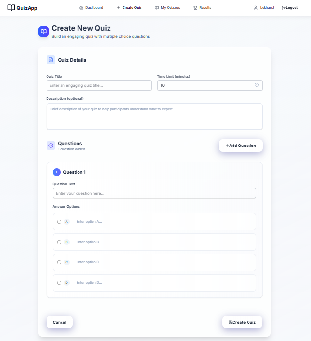
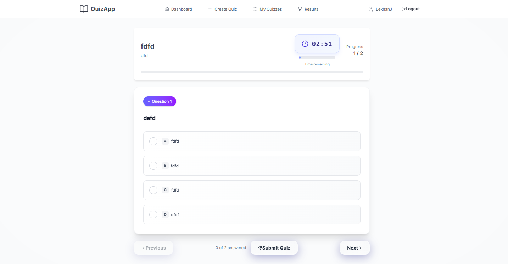
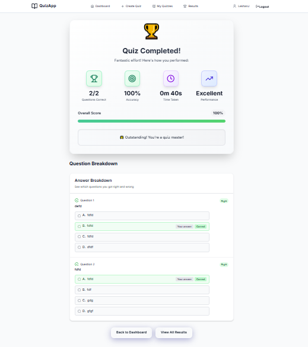
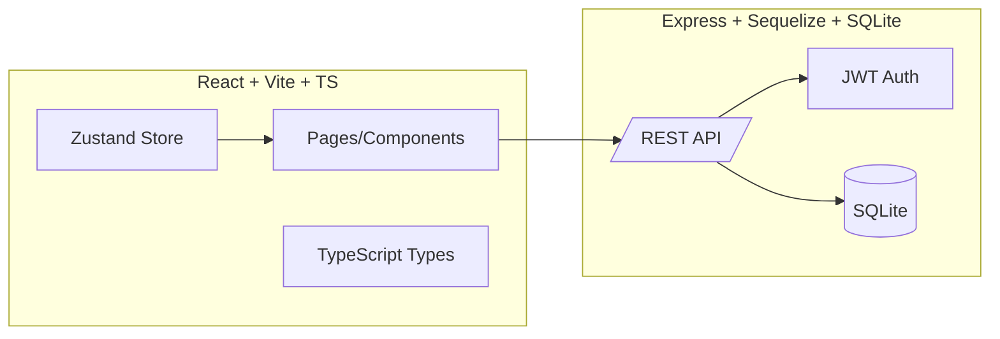

# Online-Quiz-App

An interactive web application for creating, taking, and reviewing quizzes. The app focuses on a smooth user experience, clean TypeScript models, and a modular React UI. It’s ideal for practice tests, classroom use, or quick knowledge checks.

- **Frontend**: React 19, Vite 7, Tailwind CSS 4, Zustand, React Router, React Hook Form
- **Backend**: Express 4, JWT, Sequelize 6, SQLite3, Helmet, Rate limiting, Joi validation

> Drop screenshots into `docs/images/` using the suggested filenames below and they will render in this README.


## Demo Screenshots

- Home / Landing
  
  

- Create Quiz
  
  

- Take Quiz
  
  

- Results & History
  
  

> Image placeholders: `docs/images/home.png`, `docs/images/create-quiz.png`, `docs/images/take-quiz.png`, `docs/images/results.png`.


## Table of Contents

- [Features](#features)
- [Architecture](#architecture)
- [Project Structure](#project-structure)
- [Quick Start](#quick-start)
- [Environment Variables](#environment-variables)
- [Scripts](#scripts)
- [API Reference](#api-reference)
- [Development Workflow](#development-workflow)
- [Security](#security)
- [Deployment](#deployment)
- [Troubleshooting](#troubleshooting)


## Features

- **Modern, responsive UI** with Tailwind + Headless UI
- **Type‑safe data models** across the app in `frontend/src/types/`
- **JWT authentication** with secure password hashing (bcrypt)
- **Robust API** for quizzes, submissions, and user history
- **SQLite via Sequelize** for simple, zero‑config persistence
- **Security hardening** with Helmet, rate limiting, input validation (Joi)
- **Developer‑friendly**: ESLint, Prettier, strict TS, Vite fast-refresh


## Architecture



- Frontend served by Vite during development, with a dev proxy to the backend (`/api`).
- Backend exposes secure REST endpoints under `/api/*` (`/api/auth`, `/api/quiz`, `/api/health`).


## Project Structure

```
online-quiz-app/
├─ frontend/               # React + Vite + TS app
│  ├─ src/
│  │  ├─ pages/            # e.g., Home, Quiz, Results
│  │  ├─ types/            # shared models (e.g., QuizState)
│  │  └─ ...
│  ├─ index.html
│  ├─ package.json
│  └─ vite.config.ts
│
├─ backend/                # Express API server
│  ├─ src/
│  │  ├─ routes/           # auth.js, quiz.js
│  │  ├─ controllers/
│  │  ├─ models/
│  │  ├─ middleware/
│  │  ├─ config/           # env, database
│  │  └─ server.js
│  ├─ .env.example
│  └─ package.json
│
└─ docs/
   └─ images/              # place README screenshots here
```


## Quick Start

Prerequisites:
- Node.js 18+ and npm 9+

1) Install dependencies

```
# From repo root
npm --prefix backend ci
npm --prefix frontend ci
```

2) Configure environment

- Backend: copy `.env.example` to `.env` and adjust values.
- Frontend: optional `.env.development` for dev tweaks (see [Environment Variables](#environment-variables)).

3) Run in development

```
# Terminal 1 - Backend API (http://localhost:3000)
npm --prefix backend run dev

# Terminal 2 - Frontend (http://localhost:5173)
npm --prefix frontend run dev
```

The frontend dev server will proxy `/api` to `http://localhost:3000` by default (configurable in `frontend/vite.config.ts`).


## Environment Variables

### Backend (`backend/.env`)
Refer to `backend/.env.example` for full list:

```
NODE_ENV=development
PORT=3000

JWT_SECRET=change-this-to-a-long-random-secret
JWT_EXPIRES_IN=7d

CORS_ORIGIN=http://localhost:5173

RATE_LIMIT_WINDOW_MIN=15
RATE_LIMIT_MAX=100

DB_DIALECT=sqlite
SQLITE_PATH=quiz_app.db
DB_LOGGING=false
```

### Frontend (`frontend/.env*`)
Used by Vite and available at build time:

```
# Base URL of API; frontend will proxy to /api in dev when unset
VITE_API_BASE_URL=/api

# Dev proxy target (used only when API base is /api)
VITE_DEV_SERVER_PROXY_TARGET=http://localhost:3000
```


## Scripts

### Frontend (`frontend/package.json`)
- `dev`: Start Vite dev server
- `build`: Type‑check + build production assets
- `preview`: Preview built assets locally
- `lint` / `lint:fix`: ESLint checks and autofixes
- `type-check`: TypeScript type checks without emit
- `format`: Prettier formatting

### Backend (`backend/package.json`)
- `dev`: Start server with nodemon (development)
- `start`: Start server (production)
- `test`: Run backend tests with Jest + Supertest


## API Reference

Base URL: `/api`

### Health
- `GET /api/health` → `{ status: 'OK', message: 'Quiz App API is running' }`

### Auth (`backend/src/routes/auth.js`)
- `POST /api/auth/register` → Create user
- `POST /api/auth/login` → Authenticate, returns JWT

### Quiz (`backend/src/routes/quiz.js`)
- `POST /api/quiz/` (auth) → Create a quiz
- `GET /api/quiz/` → List public quizzes
- `GET /api/quiz/my-quizzes` (auth) → List quizzes created by the current user
- `GET /api/quiz/my-results` (auth) → List current user quiz results
- `GET /api/quiz/:id` (auth) → Get a quiz by id
- `POST /api/quiz/:id/submit` (auth) → Submit answers
- `DELETE /api/quiz/:id` (auth) → Delete a quiz

> Most quiz routes require a Bearer token: `Authorization: Bearer <JWT>`.


## Development Workflow

- **Code Style**: ESLint + Prettier configured in `frontend/`. Run `npm run lint` and `npm run format` in `frontend/`.
- **Types**: Keep shared models in `frontend/src/types/` (e.g., `QuizState`) in sync with backend contracts.
- **Testing**: Backend tests via `npm --prefix backend test`. Add Supertest cases for new endpoints.
- **Security**: Add validation (Joi) in controllers for new request bodies. Keep Helmet and rate limits intact.


## Security

- **Helmet**: Sensible default HTTP headers (`backend/src/server.js`).
- **CORS**: Restrict origins via `CORS_ORIGIN`.
- **Rate Limiting**: `express-rate-limit` applied to `/api`.
- **Auth**: JWT with configurable expiration; bcrypt for hashing.
- **Validation**: Joi in controllers for input sanitization.


## Deployment

- **Frontend**: Build with `npm --prefix frontend run build`; deploy `frontend/dist/` to any static host (Netlify, Vercel, S3, Nginx, etc.).
- **Backend**: Run Node process with `npm --prefix backend run start`. For production, set strong `JWT_SECRET`, restrict `CORS_ORIGIN`, and consider moving from SQLite to Postgres/MySQL in Sequelize.
- **Reverse Proxy**: Route `/api` to backend and serve frontend statics from your CDN/origin.

Example Nginx snippet:

```nginx
location /api/ {
  proxy_pass http://localhost:3000/;
  proxy_set_header Host $host;
  proxy_set_header X-Real-IP $remote_addr;
}
```


## Troubleshooting

- Frontend cannot reach API in dev: ensure backend runs at `http://localhost:3000`, or set `VITE_DEV_SERVER_PROXY_TARGET` accordingly.
- 401 on quiz endpoints: include `Authorization: Bearer <JWT>` header returned from `POST /api/auth/login`.
- DB issues: delete the local `backend/quiz_app.db` if schema changed in dev and let Sequelize re-sync, or run migrations if you add them.

---

If you want, I can add a `docs/` template and placeholder images, or wire up CI checks (lint, test) and deploy recipes. Ready to iterate on screenshots and any branding you prefer.
